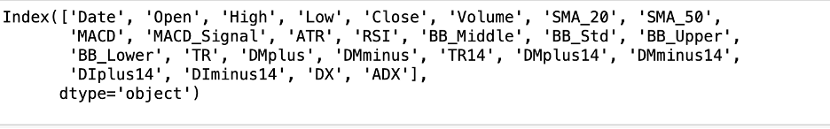
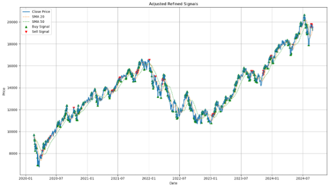
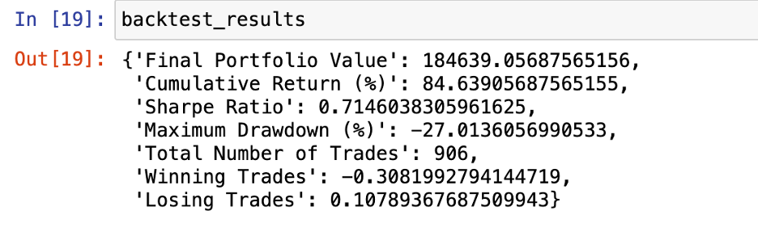
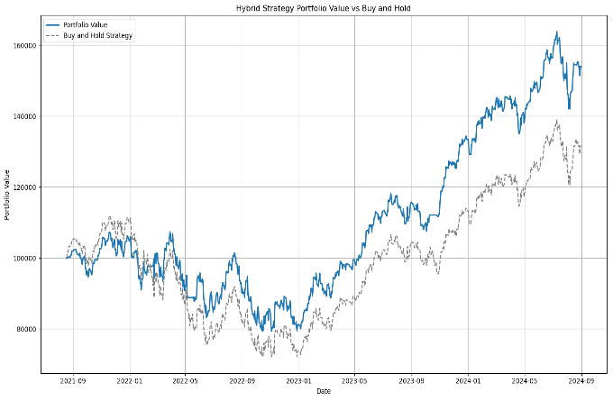

# Machine-Learning-Enhanced-Hourly-Momentum-Strategy

# 1. Objective of the Analysis

A hybrid trading strategy applied to the US technology sector, leveraging machine learning models and financial analytics. The strategy integrates technical indicators and economic factors to predict trends and make data-driven trading decisions. Historical data is analyzed from January 1, 2020, to August 08, 2024. Through systematic preprocessing, model training, and back-testing, the strategy aims to achieve consistent returns while minimizing risks. Performance metrics, such as Sharpe Ratio and Maximum Drawdown, are used to evaluate the effectiveness.

# 2. Data Description

Data Sources: Data is sourced from Yahoo Finance and other financial platforms, covering major technology stocks.
Timeframe: January 1, 2020, to December 31, 2023.
Data Frequency: Daily (1-day intervals).
Preprocessing: The dataset undergoes preprocessing, including handling missing values, feature scaling, and generating technical indicators such as Moving Averages, RSI, MACD, and Bollinger Bands.

# 3. Methodology

The strategy integrates cointegration analysis and technical indicators to generate signals. Indicators like RSI, MACD, and Bollinger Bands are used to confirm trends and refine signal generation.

# 4. Machine Learning Models

Machine learning models, including Random Forest and Gradient Boosting, are trained to predict market movements. Hyperparameter tuning ensures optimal performance. The models classify market conditions as bullish, bearish, or neutral. 
ML strategy : 
 -Used ensemble voting classifier and stacked RF and GBM tree.
 -Idea was not to overfit , all models above 95+% accuracies are overfitted and not realistic. look ahad biases are prevalant if model produces very high accuracy

# 5. Signal Generation and Trade Execution

Signals are generated based on thresholds defined by technical indicators and machine learning outputs. Trades are executed when conditions align with predefined criteria, ensuring precision and consistency. 
Signal generation : multi signal buy /sell based on buy / sell thresholds ( Basically it buys if there are multiple buys and sells if there are multiple sells )

# 6. Backtesting Approach

The data is divided into in-sample (training) and out-of-sample (testing) periods. Walk-forward optimization is used to periodically update parameters, mimicking real-time trading conditions. Transaction costs and slippage are incorporated for realistic simulations.
Back testing : ATR based multiplier stop loss, Transaction cost = 1% and slippage = 0.2 %

# 6. Results and Analysis
Key Performance Metrics:
-Cumulative Return: Approximately 84% over the test period.
-Maximum Drawdown: Around 30%
- Number of Trades: 906
-Sharpe Ratio: Ranges from .71-1.84  based on parameter sets.
The strategy demonstrates steady growth with controlled risk, outperforming simple buy-and-hold approaches in volatile conditions.

# 7 Discussion
Interpretation of Results: The strategy captures trends effectively and maintains manageable risks. It is most effective in volatile or range-bound markets but may underperform during strong bullish trends.
Risk Considerations: The approach is market-neutral and reduces directional exposure. However, reliance on model assumptions and parameter tuning may limit adaptability to extreme market conditions.

